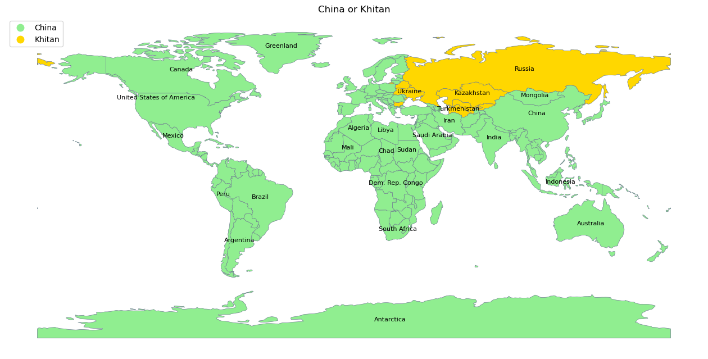

# China or Khitan

Both "China" and "Khitan" are exonyms. An exonym is a name used by one group to refer to another group or their land. It is often different from what the group calls themselves.
"China" is an exonym derived from the Sanskrit word "Cina," which was used in ancient India and Persia to refer to the Qin Empire. On the other hand, "Khitan" refers to a historical nomadic people from northeastern Asia.

 